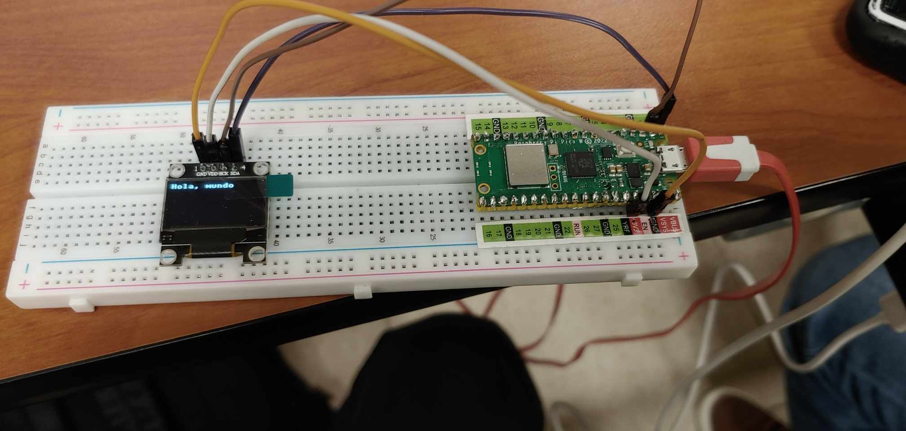
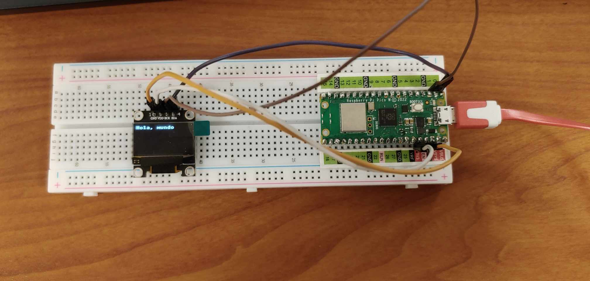
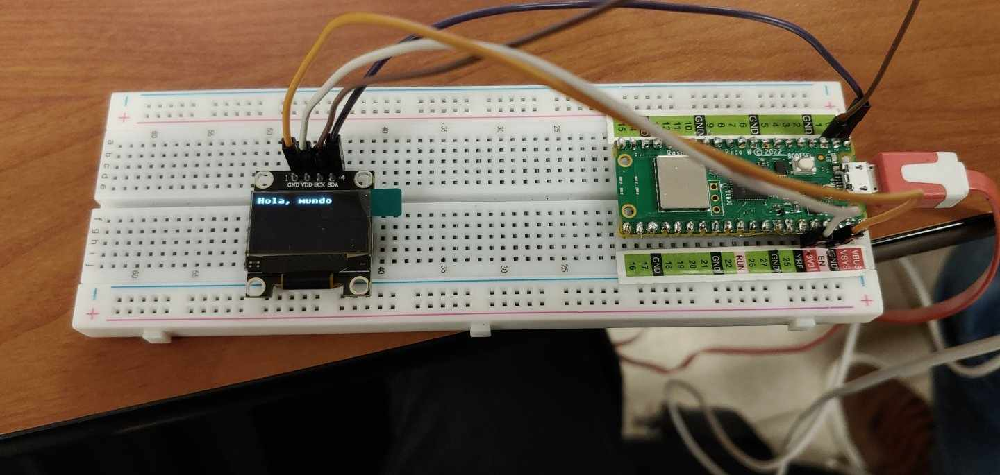

# Practica_2.1
# 2.1.1 Practica De inicio es la básico de Desplegar algo en pantalla
# Diagrama del circuito


## Circuito en funcionamiento



# CÓDIGO
```python
from machine import Pin, I2C
from ssd1306 import SSD1306_I2C
import framebuf

i2c = I2C(0, sda=Pin(0), scl=Pin(1), freq=400000)
oled = SSD1306_I2C(128, 64, i2c)

# Crea un buffer de imagen en blanco
buf = bytearray(b'\x00\x00\x00\x00\x00\x00\x00\x00\x00\x00\x00\x00\x00\x00\x00\x00'
               b'\x00\x00\x00\x00\x00\x00\x00\x00\x00\x00\x00\x00\x00\x00\x00\x00'
               b'\x00\x00\x00\x00\x00\x00\x00\x00\x00\x00\x00\x00\x00\x00\x00\x00'
               b'\x00\x00\x00\x00\x00\x00\x00\x00\x00\x00\x00\x00\x00\x00\x00\x00'
               b'\x00\x00\x00\x00\x00\x00\x00\x00\x00\x00\x00\x00\x00\x00\x00\x00'
               b'\x00\x00\x00\x00\x00\x00\x00\x00\x00\x00\x00\x00\x00\x00\x00\x00'
               b'\x00\x00\x00\x00\x00\x00\x00\x00\x00\x00\x00\x00\x00\x00\x00\x00'
               b'\x00\x00\x00\x00\x00\x00\x00\x00')

# Crea un frame buffer para la imagen
fb = framebuf.FrameBuffer(buf, 128, 64, framebuf.MONO_HLSB)

# Limpia la pantalla
oled.fill(0)
oled.show()

# Establece el tamaño de fuente y la posición de inicio
font_size = 1
x = 0
y = 0

# Dibuja "Hola, mundo" en la pantalla
oled.text("Hola, mundo", x, y, 1)

# Muestra la pantalla con el mensaje
oled.show()
```
# Resultados


# 2.1.2  Desplegar la hora de Internet en la Pico usando su Wifi integrada para que interrogue un servidor NTP Time Server, en el OLED DIsplay

# Diagrama del circuito


## Circuito en funcionamiento
(Pendiente de elaborar)

# CÓDIGO
```python
import urequests
import ssd1306
import framebuf


pix_res_x = 128
pix_res_y = 64

def init_i2c(scl_pin, sda_pin):
    # Initialize I2C device
    i2c_dev = I2C(1, scl=Pin(scl_pin), sda=Pin(sda_pin), freq=200000)
    i2c_addr = [hex(ii) for ii in i2c_dev.scan()]
    
    if not i2c_addr:
        print('No I2C Display Found')
        sys.exit()
    else:
        print("I2C Address      : {}".format(i2c_addr[0]))
        print("I2C Configuration: {}".format(i2c_dev))
    
    return i2c_dev
    

url = "http://worldtimeapi.org/api/ip"
response = urequests.get(url)
time_data = response.json()
current_time = time_data["datetime"]
response.close()

i2c_dev = init_i2c(scl_pin=27, sda_pin=26)
oled = SSD1306_I2C(pix_res_x, pix_res_y, i2c_dev)

oled.fill(0)
oled.text("Hora actual:", 0, 0)
oled.text(current_time, 0, 16)
oled.show()
```
# Resultados
(Pendiente de elaborar)
